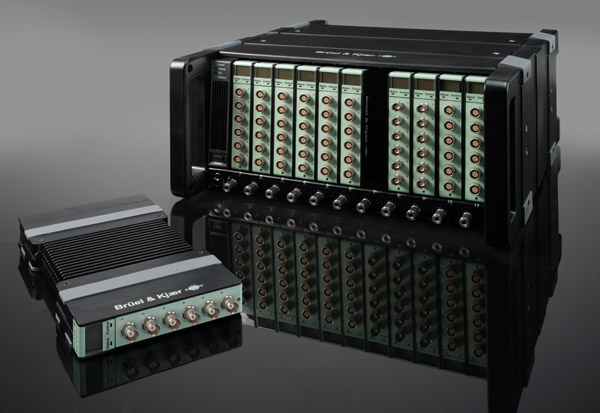

# Open API Introduction

The [LAN-XI](https://www.bksv.com/en/instruments/daq-data-acquisition/lan-xi-daq-system) platform offers great flexibility and performance.

*Modules* are compact and rugged data aquisition units that support an array of transducers and input/output channel combinations. A built-in Ethernet interface connects modules to standard computer networks, optionally providing [PoE](https://en.wikipedia.org/wiki/Power_over_Ethernet) power and [PTP](https://en.wikipedia.org/wiki/Precision_Time_Protocol) time synchronization at sub-sample level accuracy for true, single-cable operation.

*Frames* provide the ability to assemble multiple modules for stacking or mounting in racks, further reducing the need for external network equipment and power supplies whilst adding features such as GPS synchronization.

On top of this, HBK provides a range of desktop software applications for data acquisition and analysis.

## Why Open API?

Unfortunately, HBK software can't always meet every conceivable need that customers may have.

Maybe the software application you require is not available on your preferred platform, say Linux or macOS, and you want to roll your own.

You may need to interface LAN-XI directly to other software or hardware, such as MATLAB.

Or you have been tasked with implementing bespoke software for a production line, using LAN-XI hardware for acquisition and a company database for storage.

Perhaps you want to run a set of custom signal analysis algorithms on acquired data in real-time.

You might need to capture data directly onto local storage, rather than streaming on a slow or unreliable network.

Or maybe you are looking to create a smartphone application, or whip up a quick proof-of-concept demo to showcase a potential new product or algorithm.

Open API provides a pathway to doing all of those things.

## Open API

The Open API is a set of protocols that enable end-users to acquire data using one or more LAN-XI modules.

An HTTP-based protocol is used to configure modules and transducer conditioning, start and stop measurements, etc. This protocol uses standard HTTP methods such as GET, PUT, POST, and DELETE. The data interchange format is JSON.

The HTTP-based protocol is sufficient to perform measurements and store the data on an SD card inserted into each module.

To stream data back to the client while the measurement is ongoing a custom, binary protocol is used.

Measurements can be made using a single module, or multiple, PTP-synchronized modules.

## Tutorials

Tutorials and code examples written in Python are available on GitHub.

Unless otherwise specified, the code samples in this repository work with all LAN-XI module types, and have been tested on Microsoft Windows and Linux.

* [Streaming with Open API](tutorials/streaming_single_module.md) shows how to stream data from a single LAN-XI module, storing the data to a file on the local disk.

* [Interpreting Open API Streams](tutorials/streaming_interpretation.md) continues where the Streaming tutorial left off, explaining how to interpret data from Open API streams.

* [Multi-Module, Sample-Synchronous Streaming with Open API](tutorials/streaming_multi_module.md) demonstrates how to set up multiple LAN-XI modules to synchronously acquire and stream data.

* [Bridge Measurements with Open API](tutorials/bridge_measurements.md) explains how to use Open API with the LAN-XI Type 3057 Bridge module.

* [Open API Programmer's Toolbox](tutorials/programmers_toolbox.md) is a collection of cookbook-style code samples and snippets of information useful for working with the Open API.

## A Word on Firmware Versions

We recommend always using the latest [LAN-XI firmware](https://bksv.com/lanxi-firmware) version.

This can be downloaded from the page linked above, and installed through the module's homepage.

To enjoy free, unrestricted access to the Open API, ensure that your LAN-XI hardware is running firmware 2.10.0.344 or later.
