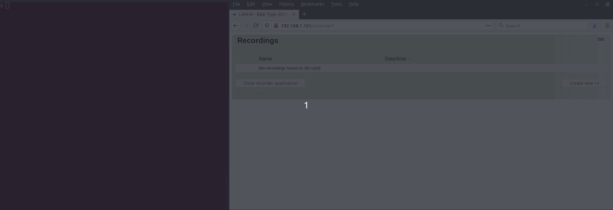
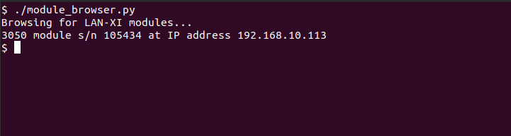

# Open API Programmer's Toolbox

The Toolbox page is a collection of cookbook-style code samples and snippets of information useful for working with the Open API.

## Installing Python

Python 3.7 or later is required to run most of the example code in this repository.

Most Linux distributions support this out of the box.

Windows users may need to follow the guidelines from Microsoft on [how to install Python on Windows](https://docs.microsoft.com/en-us/windows/python/beginners).

## Multi-Client Support

Open API supports multiple controlling client applications at any time, including the LAN-XI Notar recorder application and the module button/display.

For instance, LAN-XI Notar could be used to monitor measurements carried out by a separate software application.

For an example of this, open the home page of the LAN-XI module and click *Open recorder application*. Then run one of the example applications, such as the [streaming sample](streaming_single_module.md), and watch how Notar shows the elapsed time and signal levels while the measurement is ongoing:



Another example would be to have a software application prepare the module for a measurement, and then prompt the user to press the Control button on the module to start measuring.

To prevent accidentally starting and stopping a measurement, it is also possible to disable the Control button programmatically.

## Transducer Detection and Setup

Open API automatically performs TEDS transducer detection on start-up.

This may be undesirable for a number of reasons:

* it can be difficult to determine when the detection process starts and finishes
* it prolongs the time required to set up a new measurement from scratch
* the transducer configuration may already be known
* none of the used transducers supports TEDS
* a generator output or other external control signal is looped back to an input channel, and TEDS detection would interfere with this signal

It is possible to instruct Open API to skip automatic detection when the recorder is opened:

```python
base_url = "http://<ip>/rest/rec"

requests.put(base_url + "/open", json={"performTransducerDetection": False})
```

Transducer detection can be performed on demand as follows:

```python
base_url = "http://<ip>/rest/rec"

# Start TEDS transducer detection
requests.post(base_url + "/channels/input/all/transducers/detect")

# Wait for transducer detection to complete
prev_tag = 0
while True:
    response = requests.get(base_url + "/onchange?last=" + str(prev_tag)).json()
    prev_tag = response["lastUpdateTag"]
    if not response["transducerDetectionActive"]:
        break

# Get the result of the detection
transducers = requests.get(base_url + "/channels/input/all/transducers").json()
```

The returned result of the detection includes the fields `requiresCcld` and `requires200V`, which can be used to configure the front end e.g. to enable the [CCLD](https://www.bksv.com/en/transducers/signal-conditioning/ccld) supply.

However, be aware that those values, while accurate in most cases, are nothing more than best guesses. They are based on a transducer database embedded in the module firmware, combined with heuristics to determine the requirements of the transducer in question; in other words, they are merely suggestions and should be overridden by the end user if needed.

Also note that the use of polarisation voltage requires a front panel with LEMO connectors such as [Front Panel UA-2101](https://www.bksv.com/en/instruments/daq-data-acquisition/lan-xi-daq-system/frontpanels/ua-2101).

Not all transducers support TEDS. It is possible to manually add transducer information including the transducer type, serial number, sensitivity and engineering unit to the measurement setup.

## Setting the Time

Setting the time is good practice when performing single-module measurements.

LAN-XI modules don't have a battery-backed real-time clock, but rely on available NTP servers to obtain the current date and time.

This means that the module will use an incorrect time if an NTP server is not reachable, such as when the module is connected directly (point-to-point) to a PC, or is on a local network with no Internet access.

For PTP-synchronized, multi-module measurements the modules will obtain the time from the PTP master.

## Front-panel LED's

The Status LED immediately below the module display turns red if an error occurs during a measurement, such as data loss due to a bad network connection, or the SD card filling up.

The circular LEDs on the connectors are used to indicate various conditions relating to each individual channel:

Colour | Meaning
--- | ---
Off | Channel not in use
Green | Data from the channel is being streamed over the network, or recorded to SD card
Yellow | Channel is enabled for measurement but not currently measuring, or TEDS detection is in progress
Red | Channel is measuring but there is an overload or other signal conditioning error
Magenta | The channel is measuring and, although the channel is not currently overloaded, there was an overload or other error during the current measurement
Blue | The channel is an output or generator channel

## IPv6

Open API supports IPv6 for the HTTP-based protocol, but not for streaming at the time of writing.

IPv6 will be supported in a future firmware release, and the code samples in this repository will work with IPv6 without any modifications.

The module's IPv6 addresses are shown on the module's home page; click *Network* and look under the *IPv6* heading.

All LAN-XI modules have a link-local IPv6 address, identified by the prefix `fe80::/10`.

In order to use the link-local address to connect to the module, the name of the connecting client's Ethernet interface must be appended to the link-local address.

For instance, running the streaming sample on a Linux PC, and using the `wlp82s0` network interface on the PC to connect to the LAN-XI module, would look like this:

```shell
# Linux
$ ./streaming_single_module.py fe80::280:daff:fe00:8db0%wlp82s0
```

Note that on Microsoft Windows, `%` is a special character and requires escaping by an additional `%`. Example:

```shell
# Windows
>python.exe ./streaming_single_module.py fe80::280:daff:fe00:8db0%%33
```

## Finding Modules on the Network

LAN-XI modules support two protocols that enable client software to discover available hardware: mDNS and IdaArp.

### mDNS/Bonjour

mDNS is a standard protocol that is widely supported by a number of software libraries and operating systems.

LAN-XI modules respond to mDNS requests for `_http._tcp` services.

Many devices support `_http._tcp`, so usually you will need to filter on the service name as well. For LAN-XI, the service name follows the pattern *BK&lt;type-number&gt;-&lt;serial-number&gt;*.

This code sample scans the network for LAN-XI modules.

It requires the `requests` and `zeroconf` packages to be installed, i.e. `pip3 install requests zeroconf`.

```python
#!/usr/bin/env python3

"""Example code to demonstrate mDNS browsing for LAN-XI modules on the network."""

import re
import socket
import time
import requests
from zeroconf import ServiceBrowser, Zeroconf

class ModuleListener:

    def remove_service(self, zeroconf, service_type, service_name):
        pass

    def add_service(self, zeroconf, service_type, service_name):
        # Check if the mDNS service name matches that of a LAN-XI module
        regex = re.compile(r'^BK\d{4}-\d{6}')
        if regex.search(service_name) is not None:

            # This looks like a LAN-XI module; get its IP address
            service_info = zeroconf.get_service_info(service_type, service_name)
            addr = socket.inet_ntoa(service_info.addresses[0])

            # Request and print information about the module
            url = f'http://{addr}/rest/rec/module/info'
            module = requests.get(url).json()["module"]

            print(f'{module["type"]["number"]} module s/n {module["serial"]} at IP address {addr}')

zeroconf = Zeroconf()
listener = ModuleListener()

print(f'Browsing for LAN-XI modules...')
ServiceBrowser(zeroconf, "_http._tcp.local.", listener)

time.sleep(15)
zeroconf.close()
```

Example output:



### IdaArp

IdaArp is a custom discovery protocol that also supports other functionality such as rebooting modules or changing their IP addresses.

[Sample code in C# and Objective-C](https://github.com/hbk-world/LAN-XI-Open-API-Examples/tree/master/IdaArp) is available on GitHub.

## Other Network Protocols

LAN-XI currently does not support HTTPS, WebSocket or IPsec.

## Wireshark Support

A [Wireshark dissector for the Open API streaming protocol](https://github.com/hbk-world/LAN-XI-Open-API-Tools) is available on GitHub.

## Module Information

It is often useful to query the capabilities of a module in terms of bandwidth, available channels, filters, etc.

Software can use this to present end users with a list of options, or automatically select settings to suit the measurement task.

To request information about the module, execute

```python
base_url = "http://<ip>/rest/rec"

requests.put(base_url + "/module/info")
```

The response includes:

* the number of input and output channels
* available sample rates (divide by 2.56 to obtain the bandwidth)
* supported input ranges and filter settings
* whether an SD card is inserted
* the module type and serial number
* information on the mounted front panel
* firmware and hardware version numbers

## The Scale Factor

Sample data contained in Signal Data messages is normalized in signed 24-bit two’s complement format, sometimes referred to as [Q23](https://en.wikipedia.org/wiki/Q_%28number_format%29).

This means that the data needs to be converted in order to produce meaningful values. LAN-XI makes this easy by providing a *scale factor* that can be multiplied onto each sample:

    calibrated_value = sample_value * scale_factor

If the transducer sensitivity is not known to the module at the time of measurement then the scale factor must be calculated manually. This may be the case if the transducers that are used are not TEDS-capable, and the sensitivity was not provided manually when performing the measurement (in the `setup` structure submitted to `/rest/rec/channels/input` - see the [Streaming tutorial](streaming_single_module.md)).

The scale factor is calculated as:

    scale_factor = input_range × headroom / transducer_sensitivity

where the headroom is 1.5 dB, i.e. 10^(1.5/20) or about 1.18850.

As an example, assume that the input range on the LAN-XI module is set to 10 V, and we're using a microphone with a sensitivity of 10 mV / Pa. The resulting scale factor would then be:

    scale_factor = 10 V × 1.18850 / ( 0.01 V / Pa ) = 1188.5 Pa

## Module States

The module *state* determines the type of API requests that can be made at any given time.

Most of the time the programmer won't need to worry about this, but you may run into the odd error (typically HTTP status 403) while experimenting with the API.

In many cases the reason for the error is obvious, such as attempting to perform transducer detection while a measurement is in progress.

For more information refer to our [reference documentation](../doc/be187215.pdf), which lists each API request along with the permissible module states.

## Measurement Limitations

Currently, the `bandwidth` and `destinations` settings on each channel must be the same.

For example, it is not possible to configure Channel 1 to measure at 51.2 kHz bandwidth, and Channel 2 at 25.6 kHz bandwidth.

Similarly, all channels must be either streamed (`destinations = [ "socket" ]`) or stored on an SD card (`destinations = [ "sd" ]`). Open API does not support streaming some channels while simultaneously storing other channels on an SD card.

Finally, only one destination can be selected at a time. The modules are unable to both stream and store acquired data at the same time.

## Error Handling

The code examples in this repository omit error handling in the interest of clarity.

In a production environment, the HTTP status code should be checked after all requests.

A status code in the 4xx range indicates a client error, while a status code of 5xx means there was an error on the module. The module will include an error message in the response body.

A 5xx status may have left the module in an unstable state. The recommended action after a 5xx error is to reboot the module by executing

```python
base_url = "http://<ip>/rest/rec"

requests.put(base_url + "/reboot")
```

HBK appreciates reports of 5xx errors, if possible with a sample program or description of events leading up to the error.

Instances of 5xx errors are stored in the module's eventlog, available on the *Status* home page. The error code and additional information stored in the log may also be helpful when diagnosing errors.

## Licenses

Older firmware versions may require a license to use SD recording or streaming.

You may experience errors that indicate that a license is missing, typically in the form of HTTP status 403 being returned on certain API calls.

Should this happen, we recommend updating the module firmware to version 2.10.0.344 or later, where all API restrictions have been removed.
