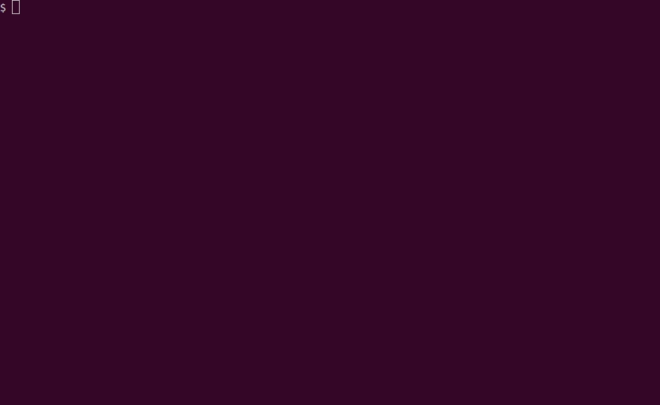
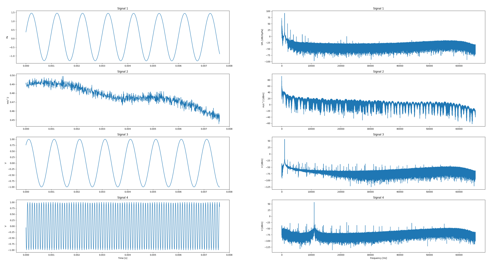

# Interpreting Open API Streams

Open API enables clients to carry out measurements and stream acquired data back to the client in near real-time.

This page is a continuation of the [Streaming with Open API](streaming_single_module.md) tutorial and explains how to process the data stream.

Note that the example code shown on this page does not support CAN measurements with the 3058 module. Refer to the BE-1872 reference manual for information on how to extend the code to support CAN measurements.

You may also be interested in

* [Multi-Module, Sample-Synchronous Streaming with Open API](streaming_multi_module.md)
* [Bridge Measurements with Open API](bridge_measurements.md)
* [Open API Programmer's Toolbox](programmers_toolbox.md)

# Example Code

The example code is written in Python.

Python 3.7 or later is required, refer to the Toolbox page for [instructions on how to install Python](programmers_toolbox.md).

You will also need to install a few Python packages:

```shell
$ pip3 install numpy kaitaistruct matplotlib
```

The Python code can be [downloaded from the src folder](../src/streaming_interpretation.py), and is also included below.

```python
#!/usr/bin/env python3
# pylint: disable=C0103

"""Example code to demonstrate streaming data processing with the LAN-XI Open API."""

from os import path
from datetime import datetime, timezone
import argparse
import numpy as np
import matplotlib.pyplot as plt
from kaitai.python.openapi_message import OpenapiMessage

def calc_time(t):
    """
    Convert an Open API 'Time' structure to a number.
    Note Kaitai doesn't support the '**' operator, or we could have implemented
    a conversion function directly in the .ksy file.
    Args:
        t: an Open API 'Time' instance
    Returns:
        the time as a built-in, numeric type
    """
    family = 2**t.time_family.k * 3**t.time_family.l * 5**t.time_family.m * 7**t.time_family.n
    return t.time_count * (1 / family)

def dbfft(input_vec, fs, ref=1):
    """
    Calculate spectrum on dB scale relative to specified reference
    Args:
        input_vec: vector containing input signal
        fs: sampling frequency
        ref: reference value used for dB calculation
    Returns:
        freq_vec: frequency vector
        spec_db: spectrum in dB scale
    """
    # Calculate windowed/scaled FFT and convert to dB relative to full-scale.
    window = np.hamming(len(input_vec))
    input_vec = input_vec * window
    spec = np.fft.rfft(input_vec)
    spec_mag = (np.abs(spec) * np.sqrt(2)) / np.sum(window)
    spec_db = 20 * np.log10(spec_mag / ref)
    # Generate frequency vector
    freq_vec = np.arange((len(input_vec) / 2) + 1) / (float(len(input_vec)) / fs)
    return freq_vec, spec_db

def get_quality_strings(l):
    """Given an 'l' list of validity objects, return a collection of descriptive strings."""
    strings = []
    for v in l:
        qs, prefix = "", ""
        if v["flags"].invalid:
            qs = qs + prefix + "Invalid Data"
            prefix = ", "
        if v["flags"].overload:
            qs = qs + prefix + "Overload"
            prefix = ", "
        if v["flags"].overrun:
            qs = qs + prefix + "Gap In Data"
            prefix = ", "
        if qs == "":
            qs = "OK"
        qs = f'{v["time"]}: ' + qs
        strings.append(qs)
    return strings

parser = argparse.ArgumentParser()
parser.add_argument("file", help="File containing Open API streaming data")
parser.add_argument("-s", "--save-plot", dest="save_plot", action='store_true', \
    help="Save plot to file")
args = parser.parse_args()

print(f'Reading streaming data from file "{args.file}"...')
file_size = path.getsize(args.file)
file_stream = open(args.file, 'rb')

# Processed data will be stored in this collection
data = {}

while True:
    # Read the next Open API message from the file
    try:
        msg = OpenapiMessage.from_io(file_stream)
    except EOFError:
        print("")
        break

    # If 'interpretation' message, then extract metadata describing how to interpret signal data
    if msg.header.message_type == OpenapiMessage.Header.EMessageType.e_interpretation:
        for i in msg.message.interpretations:
            if i.signal_id not in data:
                data[i.signal_id] = {}
            data[i.signal_id][i.descriptor_type] = i.value

    # If 'signal data' message, then copy sample data to in-memory array
    elif msg.header.message_type == OpenapiMessage.Header.EMessageType.e_signal_data:
        for s in msg.message.signals:
            if "start_time" not in data[s.signal_id]:
                start_time = datetime.fromtimestamp(calc_time(msg.header.time), timezone.utc)
                data[s.signal_id]["start_time"] = start_time
            if "samples" not in data[s.signal_id]:
                data[s.signal_id]["samples"] = np.array([])
            more_samples = np.array(list(map(lambda x: x.calc_value, s.values)))
            data[s.signal_id]["samples"] = np.append(data[s.signal_id]["samples"], more_samples)

    # If 'quality data' message, then record information on data quality issues
    elif msg.header.message_type == OpenapiMessage.Header.EMessageType.e_data_quality:
        for q in msg.message.qualities:
            if "validity" not in data[q.signal_id]:
                data[q.signal_id]["validity"] = []
            dt = datetime.fromtimestamp(calc_time(msg.header.time), timezone.utc)
            data[q.signal_id]["validity"].append({"time": dt, "flags": q.validity_flags})

    # Print progress
    print(f'{int(100 * file_stream.tell() / file_size)}%', end="\r")

# Plot time- and frequency domain data from all channels
print(f'Plotting data...')

figure, axis = plt.subplots(len(data), 2)

for index, (key, value) in enumerate(data.items()):

    # Scale samples using the scale factor from the interpretation message
    samples = value["samples"]
    scale_factor = value[OpenapiMessage.Interpretation.EDescriptorType.scale_factor]
    scaled_samples = (samples * scale_factor) / 2**23

    # Calculate FFT
    sample_rate = 1 / calc_time(value[OpenapiMessage.Interpretation.EDescriptorType.period_time])
    unit = value[OpenapiMessage.Interpretation.EDescriptorType.unit]
    if unit.data == "Pa": # Special case: Sound Pressure Level, calculate dB relative to 20 µPa
        freq, dbfs = dbfft(scaled_samples, sample_rate, ref=20 * 10**(-6))
        freq_label = "SPL [dB20µPa]"
    else:
        freq, dbfs = dbfft(scaled_samples, sample_rate, ref=0.001)
        freq_label = f'{unit.data} [dBm]'

    # Plot the first 1000 samples of the time-domain signal
    time_axis = np.array(range(0, 1000)) / sample_rate
    axis[index, 0].plot(time_axis, scaled_samples[0:len(time_axis)])
    axis[index, 0].set_title(f'Signal {key}')
    plt.setp(axis[index, 0], ylabel=unit.data)

    # Plot FFT
    axis[index, 1].plot(freq, dbfs)
    axis[index, 1].set_title(f'Signal {key}')
    plt.setp(axis[index, 1], ylabel=freq_label)

    # Print information about the signal to the console
    print(f'Signal {key}, {len(samples)} samples from {value["start_time"]}, unit {unit.data}')
    if "validity" in value:
        print(f'  Data Quality issues:')
        for s in get_quality_strings(value["validity"]):
            print(f'    {s}')

plt.setp(axis[-1, 0], xlabel='Time [s]')
plt.setp(axis[-1, 1], xlabel='Frequency [Hz]')

if args.save_plot:
    plotname = path.splitext(args.file)[0] + ".png"
    plt.savefig(plotname, dpi = 500)
    print(f'Plot saved as {plotname}')
else:
    plt.show()
```

## Running the Example

To run the example, a file containing measurement data from a LAN-XI module is required.

If you have a LAN-XI module at hand you can follow the [Streaming with Open API](streaming_single_module.md) tutorial to generate your own data file, or you can use [the provided sample file](../data/My Measurement.stream).

To run the example code, pass the path to the data file:

```shell
# Windows
>python.exe .\streaming_interpretation.py "..\data\My Measurement.stream"

# Linux
$ ./streaming_interpretation.py ../data/My\ Measurement.stream
```

The sample file contains approximately 10 seconds of data from a 4-channel 3160 module, with the input channels connected as follows:

* Channel 1: CCLD microphone mounted on calibrator
* Channel 2: CCLD accelerometer, disconnected a couple of seconds into the measurement to simulate transducer error
* Channel 3: External generator, 1 kHz sine wave, 2 Vpp
* Channel 4: External generator, 11 kHz sine wave, 2 Vpp

Running the example against the sample file produces this output:



The code also displays a plot of processed data, showing time- and frequency domain contents from each channel:



## Code Walk-Through

Skipping past the function definitions at the top, the example code performs two principal tasks:

* reads measurement data from the file, and stores it in the `data` collection in memory
* plots and prints information about the measurement from the contents of `data`

While the current implementation reads data from a file, it should be straightforward to convert the code to reading real-time data from a socket connected to a LAN-XI module, enabling live display of data.

### Processing the Data

The Open API streaming format is message-based; each block of data consists of a fixed-length header and an associated message payload.

There are three types of messages:

* *Signal Data* messages, contain raw measurement data ("the samples")
* *Interpretation* messages, metadata that specifies how to interpret or process the contents of Signal Data messages
* *Data Quality* messages, information about quality issues such as overload conditions, transducer faults, or gaps in data

We use a [Kaitai](https://kaitai.io)-based parser to process the file - see the section below for more information on this.

Reading one message at a time, we add the contents to the `data` collection.

The `data` collection is a dictionary keyed by *Signal ID*.

**Signal ID's** are numbers that uniquely identify input channels. Analog input channels are assigned consecutive Signal ID's starting from 1, whereas CAN input channels start from 101.

Note that only enabled channels have Signal ID's associated with them. As Signal ID's are numbered consecutively this means that Signal ID's don't always map to channel numbers as seen on the module. For example, a measurement that includes channels 1, 3, and 4 will contain Signal ID's 1, 2, and 3, where Signal ID 1 corresponds to input channel 1, Signal ID 2 to input channel 3, and Signal ID 3 to input channel 4.

**Interpretation messages** contain the following information:

* *Data Type*, the type of a single data sample; for LAN-XI this is always 24-bit integer
* *Scale Factor*, required to scale samples to the correct values in the specified unit
* *Offset*, for LAN-XI this is always 0 and can be ignored
* *Period Time*, the time between two samples
* *Unit*, the engineering unit of the signal, e.g. "Pa", "V", or "m/s^2"
* *Vector Length*, for LAN-XI this is always 0 and can be ignored
* *Channel Type*, documented but not used in Open API

Interpretation messages are sent before any other messages pertaining to the same Signal ID. This ensures that all information required to interpret the data will be available before the data itself.

**Signal Data messages** contain raw sample values, which we append to buffers in the `data` collection.

We also store the timestamp of the first sample received. All signals in the stream will start at the same time unless there is a gap in the data at the beginning of the measurement.

Gaps in data are usually indicative of a slow network connection, causing the LAN-XI module to drop data. In the event of this happening, the module will send a Data Quality message advising the client of an *Overrun* condition.

Some channels may have sent more data than others at the time the measurement is stopped. If client software requires all channels to end at the same time, additional logic must be implemented to trim off excess data until end times are aligned.

**Data Quality messages** are used to notify clients of issues with the acquired data such as:

* Analog overload
* Transducer conditioning errors (indicated as *Invalid Data*)
* Gaps in data

Data Quality messages are only sent when error conditions change.

For example, a transducer error that persists for an hour will result in exactly two Data Quality messages being sent; the first message to indicate the error, and the second message an hour later to say that the error is now gone.

Data should be assumed to be OK unless indicated otherwise. In other words, a complete absence of Data Quality message means the data is valid throughout.

### Plotting and Printing

As mentioned previously, the `data` collection is a dictionary keyed by Signal ID.

We iterate through the collection, processing one signal at a time.

The samples are raw, 24-bit values that must be scaled to produce meaningful results. We divide each sample by 2^23 to normalise to a range of [-1..1], and then multiply by the scale factor from the Interpretation message. The scale factor is calculated by the module and depends on the transducer sensitivity as well as the input range configured on the channel.

We then calculate FFT spectra of the data, with a special case for microphones (indicated by an engineering unit of pascal).

Time- and frequency domain data is then plotted on a grid.

Some additional information is printed to the console, including the number of samples captured, the starting time of the measurement, and any signal quality issues found.

# Kaitai Parser

We use [Kaitai Struct](https://kaitai.io/) to implement Open API parsers in a variety of programming languages.

The streaming data format is specified in [openapi_message.ksy](../src/kaitai/openapi_message.ksy), and compiled using the Kaitai Struct Compiler as shown:

```shell
$ kaitai-struct-compiler -t all openapi_message.ksy
```

Pre-compiled parsers for Python, JavaScript, C# and a number of other languages can be found in the [kaitai folder](../src/kaitai/).
