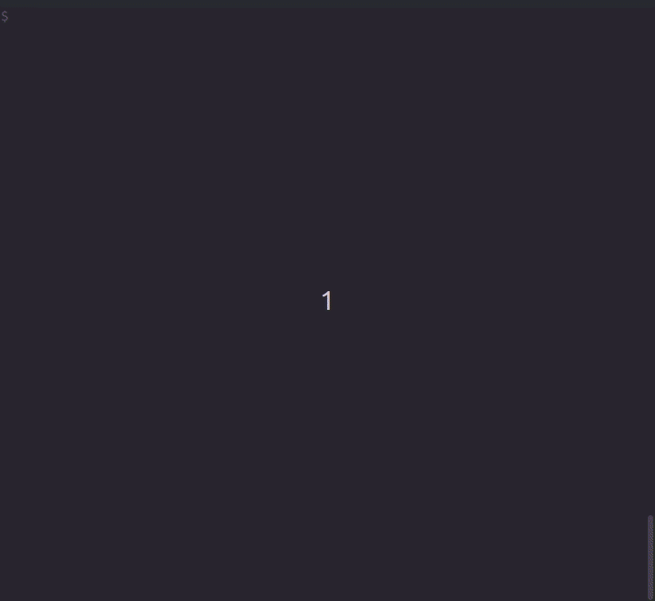

# Streaming with Open API

The Open API enables clients to carry out measurements and stream acquired data back to the client in near real-time.

This example demonstrates how to set up a LAN-XI module to perform a streaming measurement, storing the data to a file on the client.

The follow-up article [Interpreting Data from an Open API Stream](streaming_interpretation.md) explains how to interpret the data from the stream.

You may also be interested in

* [Multi-Module, Sample-Synchronous Streaming with Open API](streaming_multi_module.md)
* [Bridge Measurements with Open API](bridge_measurements.md)
* [Open API Programmer's Toolbox](programmers_toolbox.md)

# Example Code

The example code is written in Python.

Python 3.7 or later is required, refer to the Toolbox page for [instructions on how to install Python](programmers_toolbox.md).

```python
#!/usr/bin/env python3
# pylint: disable=C0103

"""Example code to demonstrate single-module streaming with the LAN-XI Open API."""

import argparse
import time
import socket
import threading
import selectors
import requests

def receive_thread(sel):
    """On selector event, reads data from associated socket and writes to file."""
    while True:
        events = sel.select()
        for key, _ in events:
            sock = key.fileobj
            data = sock.recv(16384)
            if not data:
                return
            file = key.data
            file.write(data)

def get_measurement_errors(cs):
    """Given a 'cs' array of channelStatus structures, return a collection of error strings."""
    err = []
    for i, sts in enumerate(cs):
        s, prefix = "", f"Channel {i+1}: "
        if sts["anol"] != "none":
            s = s + prefix + f'Analog Overload ({sts["anol"]})'
            prefix = ", "
        if sts["cmol"] != "none":
            s = s + prefix + f'Common Mode Overload ({sts["cmol"]})'
            prefix = ", "
        if sts["cf"] != "none":
            s = s + prefix + f'Cable Fault ({sts["cf"]})'
            prefix = ", "
        if s != "":
            err.append(s)
    return err

parser = argparse.ArgumentParser()
parser.add_argument("addr", help="IP address of the LAN-XI module")
parser.add_argument("-n", "--name", dest="name", default="My Measurement", \
    help="Name of the measurement")
parser.add_argument("-t", "--time", dest="time", default=10, type=int, \
    help="The time (in seconds) of the measurement")
args = parser.parse_args()

# Generate base URL; IPv6 addresses in URL's must be enclosed in square brackets
ip_addr = args.addr.split("%")[0] # Remove IPv6 zone index, if specified
addr_family = socket.getaddrinfo(ip_addr, port=0)[0][0]
base_url = "http://[" + args.addr + "]" if addr_family == socket.AF_INET6 else "http://" + args.addr
base_url = base_url + "/rest/rec"
args.addr = args.addr.replace("%%", "%") # Fix double per cent sign issue on Windows

print(f'Creating {args.time}-second measurement "{args.name}" on module at {ip_addr}')

# Set the module date/time
now = time.time()
requests.put(base_url + "/module/time", data=str(int(now * 1000)))

# Open the recorder and enter the configuration state
requests.put(base_url + "/open", json={"performTransducerDetection": False})
requests.put(base_url + "/create")

# Start TEDS transducer detection
print("Detecting transducers...")
requests.post(base_url + "/channels/input/all/transducers/detect")

# Wait for transducer detection to complete
prev_tag = 0
while True:
    response = requests.get(base_url + "/onchange?last=" + str(prev_tag)).json()
    prev_tag = response["lastUpdateTag"]
    if not response["transducerDetectionActive"]:
        break

# Get the result of the detection
transducers = requests.get(base_url + "/channels/input/all/transducers").json()

# Get the default measurement setup
setup = requests.get(base_url + "/channels/input/default").json()

# Select streaming rather than (the default) recording to SD card
for ch in setup["channels"]:
    ch["destinations"] = ["socket"]

# Configure front-end based on the result of transducer detection
for idx, t in enumerate(transducers):
    if t is not None:
        setup["channels"][idx]["transducer"] = t
        setup["channels"][idx]["ccld"] = t["requiresCcld"]
        setup["channels"][idx]["polvolt"] = t["requires200V"]
        print(f'Channel {idx+1}: {t["type"]["number"] + " s/n " + str(t["serialNumber"])}, '
              f'CCLD {"On" if t["requiresCcld"] == 1 else "Off"}, '
              f'Polarization Voltage {"on" if t["requires200V"] == 1 else "off"}')

# Apply the setup
print(f'Configuring module...')
requests.put(base_url + "/channels/input", json=setup)

# Store streamed data to this file
filename = args.name + ".stream"
stream_file = open(filename, "wb")

# Request the port number that the module is listening on
port = requests.get(base_url + "/destination/socket").json()["tcpPort"]

# Connect streaming socket
stream_sock = socket.create_connection((args.addr, port), timeout=10)
stream_sock.setblocking(False)

# We'll use a Python selector to manage socket I/O
selector = selectors.DefaultSelector()
selector.register(stream_sock, selectors.EVENT_READ, stream_file)

# Start thread to receive data
thread = threading.Thread(target=receive_thread, args=(selector, ))
thread.start()

# Start measuring, this will start the stream of data from the module
requests.post(base_url + "/measurements")
print("Measurement started")

# Print measurement status including any errors that may occur
prev_tag, prev_status, start = 0, "", time.time()
while time.time() - start < args.time:
    response = requests.get(base_url + "/onchange?last=" + str(prev_tag)).json()
    prev_tag = response["lastUpdateTag"]
    status = f'Measuring {response["recordingStatus"]["timeElapsed"]}'
    errors = get_measurement_errors(response["recordingStatus"]["channelStatus"])
    status = status + " " + ("OK" if len(errors) == 0 else  ", ".join(errors))
    if prev_status != status:
        print(status)
        prev_status = status

# Stop measuring
requests.put(base_url + "/measurements/stop")
print("Measurement stopped")

# Close the streaming connection, data file, and recorder
stream_sock.close()
thread.join()
stream_file.close()

requests.put(base_url + "/finish")
requests.put(base_url + "/close")

print(f'Stream saved as "{filename}"')
```

## Running the Example

The Python example can be [downloaded from the src folder](../src/streaming_single_module.py), or can be copied directly from this page into a new file.

The code uses the Python `requests` package, so run the `pip3` package manager to add this package as shown:

```shell
pip3 install requests
```

To run the code you will need a LAN-XI module and, optionally, one or more transducers with [TEDS](https://en.wikipedia.org/wiki/IEEE_1451#Transducer_electronic_data_sheet) support.

Determine the IP address of the LAN-XI module, this is shown on the display at the front of the module.

Then go ahead and run the example:

```shell
# Windows
>python.exe .\streaming_single_module.py 192.168.1.101

# Linux
$ ./streaming_single_module.py 192.168.1.101
```
Note: To see the full range of available options, run the script with the `-h` parameter.

You should see output similar to this:



## Code Walk-Through

Once past the argument parsing and IPv6 handling, we [set the time and date](programmers_toolbox.md) in the LAN-XI module so that streamed data is time-stamped correctly.

Then we open the recorder application in the module and enter the configuration state. Opening the recorder will prevent other application software such as BK Connect from attempting to control the module.

In the `open` request, we pass a parameter to disable automatic TEDS transducer detection. This is done in order to have better control over when the detection process starts and ends. We then initiate a manual detection and wait for it to finish, fetching the results.

The next step is to configure the measurement. This is where we select the input channels to include, the desired bandwidth, filter settings, conditioning setup, etc.

To simplify the configuration task, clients can request a *default setup*, make modifications to the setup, and submit it back to the module. Using the default setup as a starting point saves client software from having to build a setup structure from scratch. The default setup always enables all input channels and selects the highest supported bandwidth.

In our case, we set the `destination` on each channel to request that data be streamed on the network rather than recorded to an SD card in the module.

Also, if any transducers were detected, we attach the transducer information to the input channel, and configure CCLD and polarisation voltage based on the data returned by the API. Note that the `requiresCcld` and `requires200V` fields associated with each detected transducer are only suggestions. See [Transducer Detection and Setup](programmers_toolbox.md) for more information.

Once the setup is applied we prepare a file to store the measured data streamed from the module, and connect a socket to receive the data. At this point the module will be listening on a TCP port, so we simply request the port number from the module and connect to it.

When the streaming connection is established, we start the measurement and let it run for the time specified on the command line, reading and storing the streamed data along the way.

The module provides an array of `channelStatus` structures to report any errors that may occur during the measurement, including cable fault errors, analog overload, and common mode overload. Those errors are reported as one of

* `none`, no error has occurred during the measurement, or
* `curr`, there is currently an error, or
* `prev`, there was an error earlier in the measurement

After the measurement has stopped, we close the streaming socket and exit the recorder. The order is important here: if the streaming socket was closed before the measurement was stopped then the module would report an error due to the unavoidable loss of data. To prevent this, always stop the measurement before closing the streaming socket.

The streamed data is now stored in the file.

Proceed with [Interpreting Data from an Open API Stream](streaming_interpretation.md) to learn how to convert the data to a format useful to your application.

# Multi-Socket Streaming

In the example above, data from all input channels is streamed on a single TCP connection.

Open API offers the ability to stream each channel on a separate connection, referred to as multi-socket streaming.

This may be useful e.g. to stream a 'monitor' channel directly to a software application for display, whilst streaming the remaining channels to a different network host for processing or storage.

To configure a module to use multi-socket streaming, change the example code as follows:

* Set the `destination` on all enabled channels to `multi-socket`
* Make a `GET` request to `/rest/rec/destination/sockets`to obtain a list of TCP port numbers to connect to. The response will be a JSON array of port numbers. The first port number in the array will contain data from the first enabled channel, and so on
* Set up connections to each TCP port before starting the measurement
